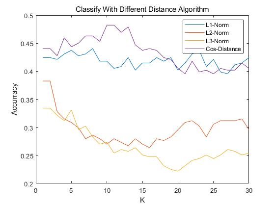
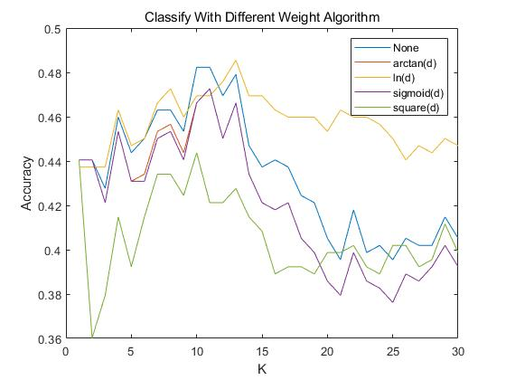

# 文本数据集的简单处理与K最近邻算法的实现

<p align="right"> 18340040 冯大纬

## 1.实验任务：文本处理与TF-IDF

- ### 实验内容

  ​	将数据集“semeval.txt”的数据表示成TF-IDF矩阵

- ### 实验原理

  

  

  

- ### 伪代码流程图

  ```c
  func Generate_TF_TDF(Sentences , Count):
  	Input:
          Sentences: An array with all sentences
          Count: Count of sentences
      Variable:
  		tf: Matrix
          idf: Matrix
          tf_idf: Matrix
      Return value:
  		tf_idf: TF-IDF Matrix
          
  	for sentence in Sentences:
  		Generate Global_Word_Dictionary: Words and its global frequency
          Generate Local_Word_Dictionary: Words and its frequency in sentence
          Total = sum(Local_Word_Dictionary[key] for key in Local_Word_Dictionary)
          for word in Local_Word_Dictionary:
              tf[index(sentence)][word] = Local_Word_Dictionary[key] / Total
      for word in Global_Word_Dictionary:
  		idf[word] = log(Global_Word_Dictionary[word] / Count
      for row in tf:
          tf_idf[row] = tf[row] * idf
      return tf_idf                    
  ```

  

- ### 关键代码

  ```python
  for i in range(len(data)):
      Target = data[i]
      LocalDict = {}
      for word in Target:
          if word not in LocalDict:
              LocalDict.update({word: 1})
          else:
              LocalDict[word] += 1
      for key, value in LocalDict.items():
          TF_MAT[i][WordList.index(key)] = value / len(Target)
  for key in WordDict.keys():
      IDF_MAT[WordList.index(key)] = math.log10(len(data) / WordDict[key])
  TF_IDF_MAT = [[] for i in range(len(data))]
  for i in range(len(TF_IDF_MAT)):
      TF_IDF_MAT[i] = mult(IDF_MAT, TF_MAT[i])
  return TF_IDF_MAT
  ```
```
  
  ​	这部分代码是从词表字典中构建TF矩阵，IDF矩阵的过程，最后将TF矩阵的每一行和IDF矩阵点乘获得TF-IDF矩阵

## 2.实验任务：KNN分类

- ### 实验内容

  ​	使用KNN进行分类任务。数据文件为classification_dataset，其中train_set用于 训练。validation_set是验证集，通过调节K值、不同距离度量等参数来筛选准确 率最好的一组参数。在测试集test上应用该参数做预测，输出结果保存为“学号_ 姓名拼音_KNN_classification.csv”

- ### 实验原理

  KNN的原理就是当预测一个新的值x的时候，根据它距离最近的K个点是什么类别来判断x属于哪个类别

  

- ### 伪代码流程图

  ```c#
  func KNN_Classify(Sample , K):
  	Input:
  	Samples: The set including our test samples
  	K: argument K for KNN Model
  	Variable:
  	DistanceList: List
  	prediction: same type as Sample label
  	
  	for sample in Samples:
  		calculate the distance from sample to target
  		join the distance into DistanceList
  	sort the DistanceList from low to high
  	choose the nearest K samples
  	use the most frequent label as prediction
  	return prediction
```

- ### 关键代码

  ```python
  def run(self):
      self.load_train()
      self.load_validation()
      self.load_test()
      self.y_Predict = [0 for i in range(len(self.x_Valid if self.mode == 'train' else self.x_Test))]
      for i in range(len(self.x_Valid if self.mode == 'train' else self.x_Test)):
          VoteDict = {}
          KNeighbour = self.get_k_nearest(self.x_Valid[i] if self.mode == 'train' else self.x_Test[i])
          for neighbour in KNeighbour:
              Vote = self.y_Train[neighbour[1]]
              if Vote not in VoteDict:
                  VoteDict.update(
                      {Vote: (1 / neighbour[0]) if not self.VoteWithWeight else self.Smooth_Method(1 / neighbour[0])})
              else:
                  VoteDict[Vote] += (1 / neighbour[0]) if not self.VoteWithWeight else self.Smooth_Method(
                      1 / neighbour[0])
          Max, Result = 0, 'Error'
          for key, value in VoteDict.items():
              if value > Max:
                  Max = value
                  Result = key
          self.y_Predict[i] = Result
  ```

- ### 实验结果分析

  #### 1.基础实验

  本次实验我选择了使用TF-IDF矩阵来构建句子的特征向量

  为了选取KNN分类模型的最优参数，我选择让K取值从1到30，并选取不同的距离函数验证准确率

  不同距离算法在KNN分类模型上的最优参数和准确率如下表

  |          | 最优参数K | 准确率              |
  | -------- | --------- | ------------------- |
  | L1范数   | 7         | 0.4405144694533762  |
  | L2范数   | 1         | 0.38263665594855306 |
  | L3范数   | 1         | 0.33440514469453375 |
  | 余弦距离 | 10        | 0.48231511254019294 |

  完整的实验结果绘制成图如下

  

  从图中以及表格结果可以看出，使用余弦距离可以获得整体较好的效果

  #### 2.优化

  在经典KNN模型中，我们会选择使用距离的倒数来作为该样本的权重，也就是距离越近，这个样本的权重就越高，但很自然地我们就会想到一个问题，假如有一个噪音离我们需要预测的点很近，比如距离为0.001，那取完倒数以后这个噪音的权重就会是1000，过高的权重会导致其他样本的投票毫无意义，所以我们需要一个映射函数将正无穷定义域上的数值尽量的压缩一下，让权重高的依然有很大的“话语权”，但不至于“一票”决定结果，这样就可以消除一些噪音的干扰。
  
  对此，我尝试了四种函数试图找到一个符合该要求的结果，这四个函数分别如下：
  $$
  x'=max(0,(1-\frac{2\times |x|}{10})^2) \ \ \ \ \ \ (二次函数)
$$
  
  $$
  x'=ln(x) \ \ \ \ \ \ (对数函数)
  $$
  
  $$
  x'=\frac{1}{1+e^{-x}} \ \ \ \ \ \ (sigmoid函数)
  $$
  
  $$
  x'=\frac{2\times arctan(x)}{\pi} \ \ \ \ \ \ (反正切函数)
  $$
  
  距离函数选择在标准模型中表现最好的距离函数余弦距离，四个函数的最优结果如下
  
  |              | 最优K | 准确率              |
  | ------------ | ----- | ------------------- |
  | 不使用核函数 | 10    | 0.48231511254019294 |
  | 二次函数     | 10    | 0.4437299035369775  |
  | 对数函数     | 13    | 0.4855305466237942  |
  | sigmoid函数  | 11    | 0.47266881028938906 |
  | 反正切函数   | 11    | 0.47266881028938906 |
  
  绘制为图如下
  
  
  
  图中蓝线为不使用核函数的效果，可以看出，有的核函数可以让结果更稳定更好，比如对数函数，但更多的核函数会导致效果下降，所以在训练的时候，选择一个正效果的核函数是非常重要的，否则反而会导致模型效果变差。
  
  在尝试了各种参数以后，我找到的KNN分类模型的最优参数是K=13, 距离函数选择余弦距离，核函数选择对数函数，可以获得约0.49的正确率。

## 3.实验任务：KNN回归

- ### 实验内容

  ​	使用KNN进行回归任务。数据文件为regression_dataset，其中train_set用于训 练。validation_set是验证集，通过调节K值、不同距离度量等参数来筛选相关系 数最好的一组参数。在测试集test上应用该参数做预测，输出结果保存为“学号_ 姓名拼音_KNN_regression.csv”

- ### 实验原理

- ### 伪代码流程图

- ### 关键代码

- ### 实验结果分析