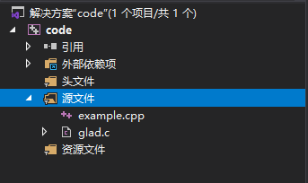
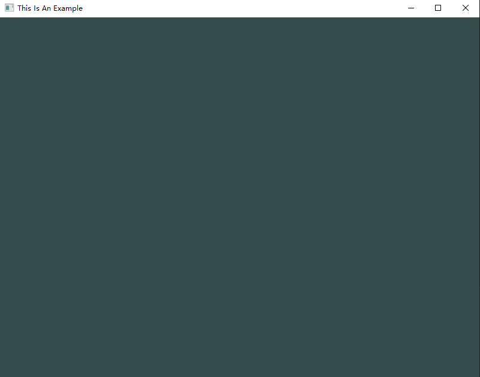

# VS2019的OpenGL项目初始环境

## 食用方法

1. ### 解压env.zip

2. ### 把解压出来的东西复制出来到你想要建立新project的文件夹

3. ### 在源文件中新建cpp/c文件

   

4. ### 开始写代码吧

5. ### 你可以尝试下面这段代码来检测能否运行

   ```c++
   #include <glad/glad.h>
   #include <GLFW/glfw3.h>
   #include <iostream>
   using namespace std;
   
   void framebuffer_size_callback(GLFWwindow* window, int width, int height) {
   	glViewport(0, 0, width, height);
   }
   
   void processInput(GLFWwindow* window) {
   	if (glfwGetKey(window, GLFW_KEY_ESCAPE) == GLFW_PRESS)
   		glfwSetWindowShouldClose(window, true);
   }
   
   int main() {
   	glfwInit();
   	glfwWindowHint(GLFW_CONTEXT_VERSION_MAJOR, 3);
   	glfwWindowHint(GLFW_CONTEXT_VERSION_MINOR, 3);
   	glfwWindowHint(GLFW_OPENGL_PROFILE, GLFW_OPENGL_CORE_PROFILE);
   
   	GLFWwindow* window = glfwCreateWindow(800, 600, "This Is An Example", nullptr, nullptr);
   	if (window == nullptr) {
   		cout << "Failed to create GLFW window" << endl;
   		glfwTerminate();
   		return -1;
   	}
   	glfwMakeContextCurrent(window);
   
   	if (!gladLoadGLLoader((GLADloadproc)glfwGetProcAddress)) {
   		cout << "Failed to initialize GLAD" << endl;
   		return -2;
   	}
   	glViewport(0, 0, 800, 600);
   
   	glfwSetFramebufferSizeCallback(window, framebuffer_size_callback);
   	while (!glfwWindowShouldClose(window)) {
   		processInput(window);
   
   		glClearColor(0.2f, 0.3f, 0.3f, 1.0f);
   		glClear(GL_COLOR_BUFFER_BIT);
   
   		glfwSwapBuffers(window);
   		glfwPollEvents();
   	}
   	glfwTerminate();
   	return 0;
   }
   ```

6. ### 如果你成功了，应该会看到这样一个框框




## 失败的处理方法

### 建议自行百度